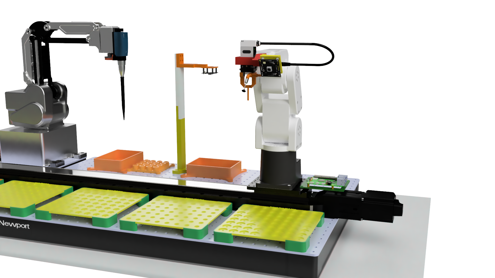
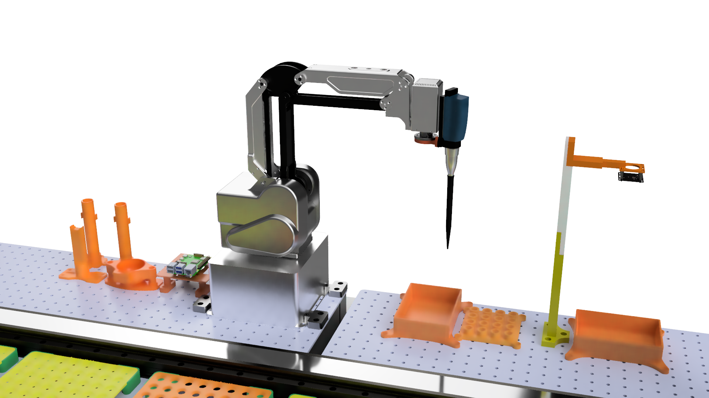

# BatteryLab

We aim to build an autonomous laboratory for manufacturing coin-cell batteries. This automated system accelerates the research process of discovering/testing new electrolytes by automatically assembling batches of CR2032 coin-cell batteries. It uses 3 robotic arms, a liquid dispensing module, a linear rail, multiple 3D printed parts, and several cameras to achieve automation.

<figure>
  
  <figcaption>Figure 1. The physical design of the autonomous BatteryLab</figcaption>
</figure>

## Get Started

> We assume that the hardware has been set up properly as illustrated in Figure 1. We will address the hardware requirement in the next section for users that want to build the system from scratch.

The code base can be separated to two parts.

The first part is the `BatteryLab` directory, which contains code that directly controls the robot, suction system, linear rail, and all the utility functions that rely purely on Python. Users should create a virtual environment with `python -m venv lab_venv` to install the Python dependencies. Do not use conda environment because they work poorly with ROS 2.

The second part is the `ros2_ws` directory, which contains several ROS 2 packages. ROS 2 is needed because we physically connect the cameras, linear rails, suction systems to different Raspberry Pis. They communicate with each other using ROS 2 services/topics. For instance, the assembly robot needs to use several cameras, controls the linear rail, and use the suction system to pick up battery components. The suction system and the arm camera is moving with the robotic arm while the fixed camera and linear rail control do not move with the robot. They have to be connected to different Raspberry Pis to avoid cable/pipe length problems.

You can install the Python dependencies with the following commands.

```bash
python -m venv lab_venv
source lab_venv/bin/activate
pip install -r requirements.txt
pip install -e .
```

Then you can use the `app.py` in the root folder to test each of the robot to ensure they work properly individually.

Ensure [ROS 2 Jazzy](https://docs.ros.org/en/jazzy/Installation.html) is properly installed in your system. To make things easier, we recommend installing Ubuntu 24.04 to all the Raspberry Pis. You should be able to build the packages by the following commands. Since we use the `cv_bridge` package to transfer image data among ROS 2 nodes, you may encounter a numpy compatibility issue as listed in [Kown Issue 1](#known-issue-1).

```bash
source /opt/ros/jazzy/
cd ros2_ws
colcon build
```

You can ssh into each Raspberry Pi to launch each ROS 2 node or use the launch file we prepared for you.

> The launch file and the ROS 2 packages are still under development.

Start all the necessary ROS 2 services by running the following commands on specified machines. Note that each of them should be run on different Raspberry Pis.

```bash
# on the rail Raspberry Pi
ros2 launch battery_lab_bringup rail_rasp.launch.py
# on the board Raspberry Pi
ros2 launch battery_lab_bringup board_rasp.launch.py
# on the outside Raspberry Pi
ros2 launch battery_lab_bringup out_rasp.launch.py
```

Then you can start controlling the whole battery lab on any machines that supports ROS 2 and in the same network.

```bash
# to control the assembly robot
ros2 run assembly_robot assembly_robot
# to control the liquid handling robot
ros2 run assembly_robot liquid_robot
# to control the crimper robot
ros2 run assembly_robot crimper_robot
```

Alternatively, you can run the general command-line app to run the whole assembly process with just one command.

```bash
ros2 run assembly_robot app
```

We plan to develop a web-based UI for easier control with a graphical interface.

## Hardware Requirements

We use the following hardware items. You do not need to use the identical items to achieve the same functionalities, but it would be easy to set up and apply our code if you use the same hardware.

- 2 Mecademic [Meca500](https://www.mecademic.com/meca500-industrial-robot/) robotic arms and 2 [MEGP-25E](https://www.mecademic.com/product/megp-25e-electric-parallel-gripper/) grippers.
- 1 [Dobot MG400](https://www.dobot-robots.com/products/desktop-four-axis/mg400.html) robotic arm.
- 1 1500mm Zaber linear rail [X-LRT1500BL-E08C](https://www.zaber.com/products/linear-stages/X-LRT-EC/specs?part=X-LRT1500BL-E08C).
- 1 [Sartorius 1-ch 200 $\mu l$](https://shop.sartorius.com/us/p/rline-1-ch-200-l-dispensing-module/710993) rLine dispensing module.
- 2 Newport optical breadboards [M-PG-23-2-ML](https://www.newport.com/p/M-PG-23-2-ML).
- 1 DIY [suction system](https://www.aliexpress.us/item/3256802124499190.html?spm=a2g0o.order_list.order_list_main.5.77f21802SE7IHi&gatewayAdapt=glo2usa).
- 2 Raspberry Pi 5s and 1 Raspberry Pi 4.
- 1 [TOB-DF-160](https://www.tobmachine.com/coin-cell-crimping-machine_c134?gad_source=1&gclid=Cj0KCQjwrKu2BhDkARIsAD7GBov9F47aTY1ZMRAuWiKtbsL2JQtdZlmeonXlnT11z4B-JgYZ6LxH1a0aAs9AEALw_wcB) Battery Crimper.
- Many self-designed 3D printable parts.

### The Assembly Robot

The assembly robot is a Meca500 on the linear rail. We have a self-designed adaptor to mount a Raspberry Pi on the Zaber AP257-ENG4299 adaptor plate. The suction system can be mounted on top of the Raspberry Pi. There is a 8MP Arducam mounted to the MEGP-25 gripper. The customized gripper has two ending effects: (1) gripper to pick up the spring; (2) the suction cup to pick up other battery components.

<figure>
  
  <figcaption>Figure 2. The design of the assembly robot.</figcaption>
</figure>

### The Liquid Handling Robot

The liquid handling robot is a Dobot MG400. We mount the Sartorius liquid dispening module to the flange with a customized adaptor. The robot needs adaptors to be mounted to the optical breadboard: the base has holes with M5 threads, and we designed 4 M5-M6 holders to mount it safely to the breadboard.

<figure>
  
  <figcaption>Figure 3. The design of the liquid handling robot.</figcaption>
</figure>

### The Crimping & Storage Robot

We use a second Meca500 to move the assembled battery to a crimper and then move it to the storage post. The gripper arm is self-designed. We also need a electronic crimper to the right of the robotic arm, which is not illustrated in the 3D design.

<figure>
  
  <figcaption>Figure 4. The design of the crimping & storage robot.</figcaption>
</figure>

## Known Issues

### 1. prebuilt cv_bridge package is not compatible with Numpy 2.0

<a name="known-issue-1"></a>
We added a submodule to build the cv_bridge from source to fix this problem. You need to install the Boost Python library to build this package. The required packages can be installed by the following commands.

```bash
sudo apt update
sudo apt install libboost-all-dev
```

And because we have a submodule in the repo. You may need to fetch the submodules before running `colcon build`.

```bash
git submodule update --init --recursive
```
